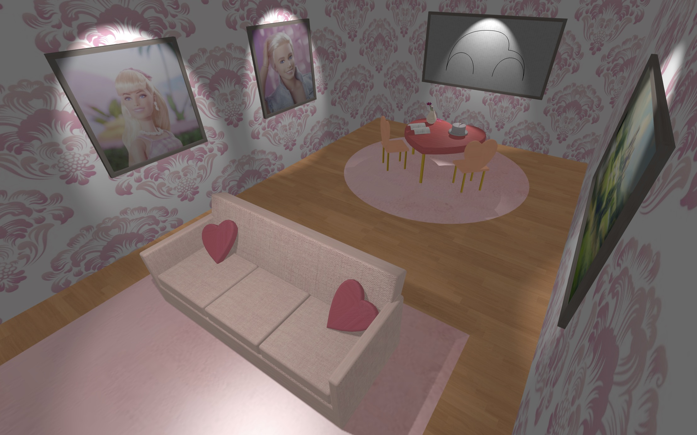

# SGI 2024/2025 - TP1

## Group: T03G09

| Name             | Number    | E-Mail               |
| ---------------- | --------- | -------------------- |
| Catarina Canelas | 202103628 | up202103628@fe.up.pt |
| Pedro Beirão     | 202108718 | up202108718@fe.up.pt |

----
## Project information

We used THREE.js to make a 3d scene that demonstrates several concepts. From simple geometry, curves, materials, shaders, and lights.
This scene is Barbie themed.

A few noteworthy features:
- Lights projected from spotlights that cast shadows over objects.
- A mirror shader to reflect the whole scene.
- Use of Shape() to create more complex geometry.
- Curves and Nurbs
- Customization from the GUI

Scene description:
- Rectangular room with a table and a sofa
- The table contains a few items:
  - Newspaper
  - Cake
  - Flower pot
  - Spring
- The sofa had 2 heart shaped pillow
- There are heart shaped chairs around the table
- 2 paintings of Barbie and Ken are hung on the wall
- In another wall, there is a window with a landscape
- There is also a silhouette of a "beetle" car
- A big mirror is hung in the wall as well
- The scene is iluminated by some ambient light, as well as some spotlights that cast shadows over certain objects

