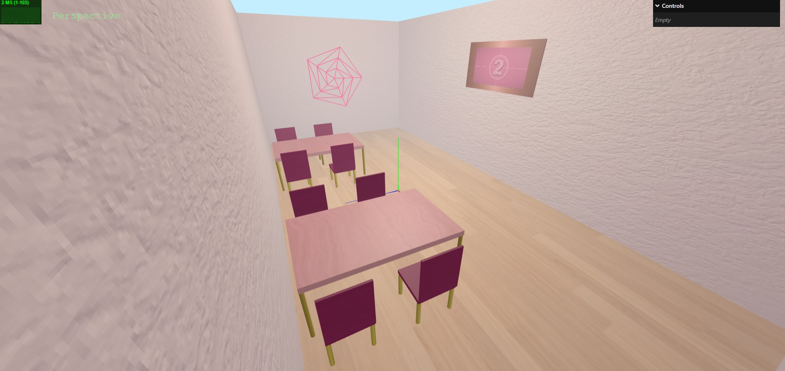

# SGI 2024/2025 - TP1

## Group: T03G09

| Name             | Number    | E-Mail               |
| ---------------- | --------- | -------------------- |
| Catarina Canelas | 202103628 | up202103628@fe.up.pt |
| Pedro Beirão     | 202108718 | up202108718@fe.up.pt |

----
## Project information

Using THREE.js, I created a 3D scene that showcases 3D concepts, combining simple and advanced elements. The project features basic objects like tables, chairs, and a TV, along with textures, including advanced ones like bump mapping and video textures and some lights like pointlights and spotlights. Buffer geometry was also employed.
This scene is Barbie themed.

The scene was constructed using a custom parser that integrates multiple components:

MyFileReader: Reads and processes the data.
MySceneData: Organizes the scene's structure and details.
LoadObjects: Builds the scene graph dynamically from a provided JSON file.

A few noteworthy features:
- TV with video-texture.
- Bump-texture on walls.
- Use of buffer geometry.

Scene description:
- Rectangular room with two tables and chairs
- Television with a video playing
- a spiral with buffer geometry
- a backgroung
- The scene is iluminated by some ambient light, as well spotlights and pointlights that cast shadows over certain objects

